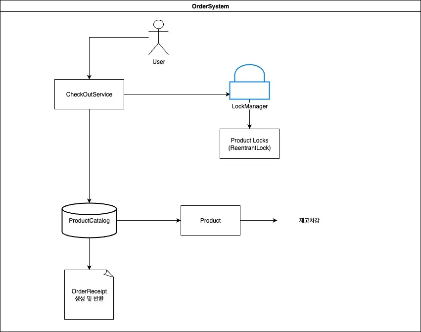

# **콘솔 기반 주문·결제 시스템 (OrderSystem)**

# **PROJECT**

# **콘솔 기반 주문·결제 시스템 (OrderSystem)**

*2025.09 ~ 2025.09*

Java 17, Gradle, JUnit5

## **프로젝트 목적**

다중 사용자가 동시에 주문을 진행하는 상황에서 재고 무결성을 보장하고,

데드락 없이 안정적으로 주문·결제를 처리할 수 있는 시스템을 구현하는 것을 목표로 하였습니다.

---

## **상황**

주문 서비스에서는 동시에 여러 사용자가 같은 상품을 구매하는 경우가 발생합니다.

단순히 재고를 차감하는 방식으로 처리하면 Lost Update나 재고 음수 발생 같은 문제가 생길 수 있습니다.

또한 여러 상품을 동시에 주문할 때 잘못된 락 순서로 인해 데드락(Deadlock) 위험도 존재합니다.

---

## **실행**

- **락 매니저 설계**
  - ReentrantLock을 상품 단위로 관리
  - productId 기준 정렬 후 순차적으로 락을 획득, 역순으로 해제하여 교착 상태 방지
- **주문 처리 흐름**
  1. 주문 요청 파라미터 검증 (수량 ≥ 1)
  2. 전체 상품의 재고 가능 여부 선확인
  3. 모든 상품이 가능할 경우에만 일괄 차감 처리
  4. 주문 금액·배송비 계산 후 OrderReceipt 발행
- **배송 정책**
  - 주문 총액 5만원 이상: 무료배송
  - 주문 총액 5만원 미만: 배송비 2,500원 부과
- **테스트**
  - JUnit5 기반 단위 테스트 작성
  - 다중 스레드 환경에서 동시에 같은 상품을 주문했을 때, 정확한 재고 차감이 보장되는지 검증

---

## **결과**

- **동시성 안정성 확보**

  상품별 락과 정렬된 획득/해제 방식으로 데드락을 방지하고,

  다중 사용자 환경에서도 재고가 음수가 되지 않음을 확인했습니다.

- **원자적 처리 보장**

  주문 품목 중 하나라도 재고 부족 시, 모든 품목이 차감되지 않고 예외를 발생시켜

  일관성을 유지했습니다.

- **확장성**

  현재는 콘솔 기반 주문 시스템이지만, 추후 Web API로 확장 시에도 동일한 동시성 제어 패턴을 적용할 수 있습니다.




<details>
<summary>📚 동시성 테스트 학습 정리 (펼치기)</summary>
이때까지 구현을 하면서 동시성에 테스트는 정작 해본적이 없는거 같아서 chatgpt 및 검색을 통해서 알아보는 계기가 되었다.

https://megak.tistory.com/155

### **✔ Runnable vs Callable**

- **Runnable**: void run(), 반환값/체크예외 없음 → “실행만”
- **Callable**: T call() throws Exception → **반환값**/예외 가능

Runnable과 Callable은 멀티 스레드를 구현하기 위한 사용되는 인터페이스이다.

Runnable 인터페이스 안에서 구현하는 객체 run()을 구현해야한다.

- run() 메서드 안에는 스레드가 실행할 코드가 들어감
- run() 메서드를 실행하는 스레드는 start() 메서드를 호출하여 시작할 수 있음

```java
**public class MyRunnable implements Runnable {
    @Override
    public void run() {
        // 스레드가 실행할 작업을 여기에 구현
    }

    public static void main(String[] args) {
        MyRunnable myRunnable = new MyRunnable();
        Thread thread = new Thread(myRunnable);
        thread.start(); // 스레드 시작
    }
}**
```

Runnable과 다르게 Callable은 제너릭 인터페이스로 반환값을 가질수가 있다.

- Callable 인터페이스를 구현하는 객체는 call() 메서드를 구현해야함
    - call() 메서드는 스레드가 실행될 때 호출되고, 실행 결과를 반환함
- Callable을 사용하는 경우에는 'ExecutorSevice'를 사용하여 스레드를 실행함

```java
import java.util.concurrent.*;

public class MyCallable implements Callable<Integer> {
    @Override
    public Integer call() throws Exception {
        // 스레드가 실행할 작업을 여기에 구현
        return 42; // 예시로 정수 42를 반환
    }

    public static void main(String[] args) throws ExecutionException, InterruptedException {
        MyCallable myCallable = new MyCallable();
        ExecutorService executorService = Executors.newSingleThreadExecutor();
        Future<Integer> future = executorService.submit(myCallable);

        // 작업 완료 대기하고 결과 값 가져오기
        int result = future.get();
        System.out.println("결과: " + result);

        executorService.shutdown();
    }
}
```

https://dkswnkk.tistory.com/733

### **✔ Future**

- 비동기 작업의 핸들
- get()으로 결과 받거나 완료까지 대기 (Blocking)
- isDone(), cancel() 등 기본 제어 메서드 제공
- 결과를 조합하거나 후속 작업을 등록하는 기능은 없음
- 예외 처리도 제한적 (ExecutionException 정도만 확인 가능)

### **✔ CompletableFuture**

- 비동기 작업의 핸들 (Future 확장판)
- get()으로 결과 받거나 완료까지 대기 가능
- isDone(), cancel() 등 **Future의 모든 기능 지원**
- thenApply, thenAccept, thenRun 등 **후속 작업(콜백) 등록 가능**
- thenCombine, allOf, anyOf 등으로 **여러 비동기 작업 조합 가능**
- exceptionally, handle 등을 통한 **풍부한 예외 처리** 지원
- complete() / completeExceptionally() 로 **외부에서 강제 완료 처리 가능**

### **✔ ExecutorService**

- 스레드 풀 구성하고 효율적인 스레드 실행을 관리해줍니다
- 직접 스레드를 생성 및 제어하는 방식보다 안전하고 유지보수가 쉽다.

### 주요메서드

- Executors.newFixedThreadPool(n) → n개 스레드를 가진 고정 스레드 풀
- Executors.newCachedThreadPool() → 필요할 때마다 스레드 생성, 일정 시간 지나면 반환
- Executors.newSingleThreadExecutor() → 스레드 1개만 사용하는 풀
- Executors.newScheduledThreadPool(n) → 일정 시간 뒤 실행 / 주기적 실행 가능

---

- submit(Runnable task) : 실행만 하는 작업 제출 (Future<?> 반환)
- submit(Callable<T> task) : 실행 후 결과를 돌려주는 작업 제출 (Future<T> 반환)
- invokeAll(Collection<Callable>) : 여러 작업을 동시에 실행하고, **모든 결과**가 올 때까지 대기
- invokeAny(Collection<Callable>) : 여러 작업 중 **가장 먼저 끝난 결과 하나만** 가져옴
- shutdown() : 새로운 작업은 받지 않고, 현재 작업만 마친 뒤 종료
- shutdownNow() : 실행 중인 작업도 멈추고 강제 종료 시도

```java
import java.util.concurrent.*;

public class ConcurrencyTest {
    public static void main(String[] args) throws ExecutionException, InterruptedException {
        Runnable runnableTask = () -> {
            System.out.println("Runnable 실행! 스레드: " + Thread.currentThread().getName());
        };

        ExecutorService executor = Executors.newFixedThreadPool(2);
        executor.submit(runnableTask);

        // Callable 테스트
        Callable<Integer> callableTask = () -> {
            System.out.println("Callable 실행! 스레드: " + Thread.currentThread().getName());
            return 123; // 결과 반환
        };

        Future<Integer> result = executor.submit(callableTask);
        System.out.println("Callable 결과 = " + result.get());

        executor.shutdown();

    }
}

```

### **✔ CountDownLatch**

- 스레드들을 특정 시점까지 **대기**시키고 **동시에 출발**시키는 동기화 도구
    - new CountDownLatch(1): 출발 신호 1번 기다림
    - await(): 0 될 때까지 대기
    - countDown(): 카운트 1 감소(0이 되면 대기 중 스레드 해제)

### **✔ AtomicInteger**

- 스레드 안전한 카운터(+1/-1 등)
- 동시 증가/감소 시 레이스 컨디션 없이 정확히 집계

```java
 @Test
    void testOrderMultiThread() throws ExecutionException, InterruptedException {
        ProductCatalog catalog = new ProductCatalog();
        CheckOutService checkOutService = new CheckOutService(catalog);

        long pid = 648418L; // 재고 5개짜리 상품

        // 두 스레드가 각각 4개씩 주문 → 총 8개 주문 → 한 쪽은 실패해야 정상
        Callable<Boolean> task = () -> {
            Map<Long, Integer> req = new LinkedHashMap<>();
            req.put(pid, 4);
            try {
                checkOutService.checkOut(req);
                return true; // 성공
            } catch (SoldOutException e) {
                return false; // 실패(기대한 케이스)
            }
        };

        // 동시에 시작시키기 위한 래치
        CountDownLatch start = new CountDownLatch(1);
        ExecutorService es = Executors.newFixedThreadPool(2);
        AtomicInteger success = new AtomicInteger();
        AtomicInteger fail = new AtomicInteger();

        Future<?> f1 = es.submit(() -> {
            try {
                start.await(); // 동시 출발 대기
                if (task.call()) success.incrementAndGet();
                else fail.incrementAndGet();
            } catch (Exception e) {
                e.printStackTrace();
            }
        });

        Future<?> f2 = es.submit(() -> {
            try {
                start.await();
                if (task.call()) success.incrementAndGet();
                else fail.incrementAndGet();
            } catch (Exception e) {
                e.printStackTrace();
            }
        });

        // 동시에 출발
        start.countDown();
        f1.get();
        f2.get();
        es.shutdown();

        // 기대: 1 성공 / 1 실패 (최소 1 실패는 반드시 있어야 한다)
        assertTrue(fail.get() >= 1, "동시 주문에서 최소 한쪽은 SoldOutException이어야 합니다.");
    }
```